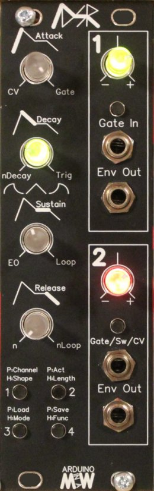

The MiaW ADSR is the final product of a long process to make the most versatile and visually "useful" ADSR. While an AD is easy to build in a DIY manner, an ADSR is a bit more complex. if you then want a bunch of extra features and functions you need to use a MCU. This is an Arduino controlled ADSR that has loads of features. The output is driven by Dual PWM which creates a very smooth -+8V signal.

Hardware features consists of:

Two gate/trigger inputs where input 2 doubles as a CV-input.

Four backlit transparent pots that shows which phase of the envelope you are in. These are used for both channels, and also for changing parameters.

Two outputs with intenuverters, making it possible to attenuate the output signal between 0-8V or output an inverted signal between 0 and -8V.

Manual trig buttons for both channels

Four meny buttons for setting parameters.

Software features consists of:

Two independent ADSRs internally routable.

Four ways the ADSRs act on the input, Gate (ADSR), Trig (ADR), Loop (ADR Looping), and nLoop (ADR looping with a twist).

Load and Save of the state of the Module to easily continue after powering the modular down.

Shape, tune the shape of each phase of the envelope between Exponential (fast start, slow end) through Linear to Logarithmic (slow start, fast end)

Length, each pot for each phase of the envelope can be set to have a working are of either 1s, 10s or 100s (settable in software) for reeeeaaaally long envelopes.

There are also some more experimental features that works but maybe not flawlessly yet... ;) Some of them are:

Modes, for routing the ADSRs internally to outputs. eg. ADSR1 on both outputs. Input 1 triggers both ADSRs, etc etc.

CV control, makes input 2 to a CV input that can control one of the parameters of the first channel (A, D, S or R).

EO (End Of...) you can set which phase the EO on channel 1 should trigger the Envelope on channel 2.

nLoop, is a loop that either loops as long as the gate is held, or can be set to a specific number of loops (n) that it will loop.

nLoopDecay, in nLoop you can have the amplitude of the envelope to decay over time.

Why did you make it?
I wanted a visually pleasing ADSR, that actually shows you what is going on, and I wanted to make a project with an Arduino using Dual PWM and I thought this would be a great project to start with.

What makes it special?
Well the visual element is not something I have seen before. Some of the features are really nice in such a compact module, although I guess all these functions have been seen in other modules before. The price point of this module and what you get in functionality for the money is also unbeatable...

The standard full kit comes without the Arduino, because it is so easy to source it yourself, and program it. Here is one place I have bought Arduino Nanos for around 3$ nowadays

[Link to iBOM for back PCB]((https://htmlpreview.github.io/?https://github.com/SourceryOne/Arduino-ADSR/blob/main/ADSR_Back_PCB_iBOM_v1.html)

[Link to iBOM for front PCB](https://htmlpreview.github.io/?https://github.com/SourceryOne/Arduino-ADSR/blob/ADSR_Front_PCB_iBOM_v1.html)

Walkthrough video: 

Build video: [https://youtu.be/0yI4aH5QmAo](https://youtu.be/0yI4aH5QmAo)

You can buy a kit or just the PCB/Panel set in my Tindie store here [https://www.tindie.com/products/Sourcery/adsr/](https://www.tindie.com/products/Sourcery/adsr/)

[MiaW ADSR on ModularGrid](https://modulargrid.com/e/miaw-adsr)
